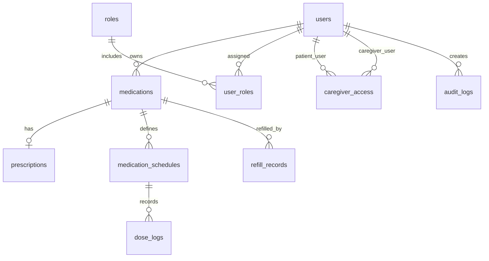

# MedMinder Database Design

## Overview

MedMinder uses a normalized PostgreSQL schema to support medication tracking, schedule management, dose logging, refill reminders, caregiver access, and audit monitoring.

This document focuses on the Database course requirements:

- normalized schema
- SQL functions and queries
- constraints
- example results
- security explanation
- optimization

API design is intentionally not the focus of this document.

The final database should contain around 10 rows or more for each main table where reasonable, using fake data only.

## Main Tables

### users

**Purpose**  
Stores identity records for all system users.

**Important fields**
- user_id
- full_name
- email
- password_hash
- phone
- is_active
- created_at
- updated_at

**Primary key**
- user_id

**Foreign keys**
- None

**Important constraints**
- email is unique
- password_hash is required
- is_active defaults to true

**Why this table is needed**  
It is the base identity and ownership table for authentication and access control.

### roles

**Purpose**  
Stores role definitions.

**Important fields**
- role_id
- role_name
- description

**Primary key**
- role_id

**Foreign keys**
- None

**Important constraints**
- role_name is unique

**Why this table is needed**  
It supports flexible role-based access control.

### user_roles

**Purpose**  
Maps users to roles.

**Important fields**
- user_role_id
- user_id
- role_id
- assigned_at

**Primary key**
- user_role_id

**Foreign keys**
- user_id -> users.user_id
- role_id -> roles.role_id

**Important constraints**
- unique (user_id, role_id)

**Why this table is needed**  
It supports normalized many-to-many role assignment.

### medications

**Purpose**  
Stores the medication records owned by each user.

**Important fields**
- medication_id
- user_id
- medicine_name
- dosage
- form
- current_quantity
- refill_threshold
- is_active
- start_date
- end_date
- notes

**Primary key**
- medication_id

**Foreign keys**
- user_id -> users.user_id

**Important constraints**
- medicine_name is required
- current_quantity >= 0
- refill_threshold >= 0
- is_active defaults to true

**Why this table is needed**  
It is the core source for medication inventory and schedule linkage.

### prescriptions

**Purpose**  
Stores optional prescription metadata only.

**Important fields**
- prescription_id
- medication_id
- prescribed_by
- clinic_name
- issue_date
- instructions

**Primary key**
- prescription_id

**Foreign keys**
- medication_id -> medications.medication_id

**Important constraints**
- medication_id is required

**Why this table is needed**  
It satisfies the required schema while keeping prescription scope simple and non-clinical.

### medication_schedules

**Purpose**  
Stores recurring medication schedule definitions.

**Important fields**
- schedule_id
- medication_id
- user_id
- scheduled_time
- dose_amount
- frequency
- start_date
- end_date
- is_active

**Primary key**
- schedule_id

**Foreign keys**
- medication_id -> medications.medication_id
- user_id -> users.user_id

**Important constraints**
- scheduled_time is required
- dose_amount > 0
- frequency is required
- frequency supports `DAILY` in the first version
- is_active defaults to true

**Why this table is needed**  
It separates schedule rules from medication master data.

### dose_logs

**Purpose**  
Stores actual dose events that users recorded.

**Important fields**
- dose_log_id
- schedule_id
- user_id
- scheduled_datetime
- actual_taken_time
- status
- created_at

**Primary key**
- dose_log_id

**Foreign keys**
- schedule_id -> medication_schedules.schedule_id
- user_id -> users.user_id

**Important constraints**
- scheduled_datetime is required
- status must be one of TAKEN, MISSED, SKIPPED, LATE

**Why this table is needed**  
It supports dose history, adherence reports, caregiver monitoring, and auditability.

**PENDING clarification**  
`PENDING` should be derived in query logic for today's dashboard when a scheduled dose has no matching `dose_logs` record yet. It does not need to be stored as a persistent logged status.

### refill_records

**Purpose**  
Stores refill actions that increase medication quantity.

**Important fields**
- refill_id
- medication_id
- user_id
- refill_date
- quantity_added
- note

**Primary key**
- refill_id

**Foreign keys**
- medication_id -> medications.medication_id
- user_id -> users.user_id

**Important constraints**
- refill_date is required
- quantity_added > 0

**Why this table is needed**  
It tracks refill activity separately from medication records.

### caregiver_access

**Purpose**  
Stores caregiver access relationships.

**Important fields**
- access_id
- user_id
- caregiver_id
- access_status
- granted_at

**Primary key**
- access_id

**Foreign keys**
- user_id -> users.user_id
- caregiver_id -> users.user_id

**Important constraints**
- access_status must be one of PENDING, APPROVED, REVOKED
- unique (user_id, caregiver_id)

**Why this table is needed**  
It enforces limited read-only sharing between users and caregivers.

### audit_logs

**Purpose**  
Stores sensitive actions for monitoring and reporting.

**Important fields**
- audit_id
- user_id
- action
- target_table
- target_id
- created_at

**Primary key**
- audit_id

**Foreign keys**
- user_id -> users.user_id

**Important constraints**
- action is required
- target_table is required
- created_at defaults to current timestamp

**Why this table is needed**  
It supports security review, admin monitoring, and system reporting.

## Normalization Summary

### 1NF
All columns store atomic values. There are no repeating groups in a single field.

### 2NF
Non-key attributes depend on the whole primary key. Role assignments and schedules are separated into their own tables instead of being mixed into `users` or `medications`.

### 3NF
Non-key attributes depend only on the primary key, not on other non-key attributes. Role data is stored in `roles`, schedule data is stored in `medication_schedules`, and refill actions are stored in `refill_records`.

## Core Integrity Rules

- medications.current_quantity >= 0
- medications.refill_threshold >= 0
- medication_schedules.dose_amount > 0
- medication_schedules.scheduled_time is required
- dose_logs.status in (TAKEN, MISSED, SKIPPED, LATE)
- caregiver_access.access_status in (PENDING, APPROVED, REVOKED)
- every medication belongs to a valid user
- every schedule belongs to a valid medication and valid user
- every dose log belongs to a valid schedule and valid user
- every refill record belongs to a valid medication and valid user

## Ownership Consistency Rules

Some child tables store `user_id` to simplify filtering and improve query performance. This creates an ownership consistency requirement:

- `medication_schedules.user_id` must match the owner in `medications.user_id`
- `dose_logs.user_id` must match the owner of the related schedule
- `refill_records.user_id` must match the owner of the related medication

In PostgreSQL, this can be enforced with composite unique keys and composite foreign keys where practical. Remaining checks should be enforced in service-layer validation inside one transaction.

## Soft Delete Policy

The system should prefer soft delete for important user-owned records:

- users should normally be deactivated with `is_active = false`
- medications should normally be marked inactive with `is_active = false`
- audit logs should never be automatically deleted as part of normal record cleanup

This preserves history for reports, audit review, and educational demonstration.

## PostgreSQL DDL

```sql
CREATE TABLE users (
    user_id BIGSERIAL PRIMARY KEY,
    full_name VARCHAR(150) NOT NULL,
    email VARCHAR(255) NOT NULL UNIQUE,
    password_hash VARCHAR(255) NOT NULL,
    phone VARCHAR(30),
    is_active BOOLEAN NOT NULL DEFAULT TRUE,
    created_at TIMESTAMPTZ NOT NULL DEFAULT CURRENT_TIMESTAMP,
    updated_at TIMESTAMPTZ NOT NULL DEFAULT CURRENT_TIMESTAMP
);

CREATE TABLE roles (
    role_id BIGSERIAL PRIMARY KEY,
    role_name VARCHAR(50) NOT NULL UNIQUE,
    description TEXT
);

CREATE TABLE user_roles (
    user_role_id BIGSERIAL PRIMARY KEY,
    user_id BIGINT NOT NULL,
    role_id BIGINT NOT NULL,
    assigned_at TIMESTAMPTZ NOT NULL DEFAULT CURRENT_TIMESTAMP,
    CONSTRAINT uq_user_roles_user_role UNIQUE (user_id, role_id),
    CONSTRAINT fk_user_roles_user
        FOREIGN KEY (user_id) REFERENCES users(user_id),
    CONSTRAINT fk_user_roles_role
        FOREIGN KEY (role_id) REFERENCES roles(role_id)
);

CREATE TABLE medications (
    medication_id BIGSERIAL PRIMARY KEY,
    user_id BIGINT NOT NULL,
    medicine_name VARCHAR(150) NOT NULL,
    dosage VARCHAR(100) NOT NULL,
    form VARCHAR(50) NOT NULL,
    current_quantity INTEGER NOT NULL DEFAULT 0 CHECK (current_quantity >= 0),
    refill_threshold INTEGER NOT NULL DEFAULT 0 CHECK (refill_threshold >= 0),
    is_active BOOLEAN NOT NULL DEFAULT TRUE,
    start_date DATE,
    end_date DATE,
    notes TEXT,
    created_at TIMESTAMPTZ NOT NULL DEFAULT CURRENT_TIMESTAMP,
    updated_at TIMESTAMPTZ NOT NULL DEFAULT CURRENT_TIMESTAMP,
    CONSTRAINT fk_medications_user
        FOREIGN KEY (user_id) REFERENCES users(user_id),
    CONSTRAINT uq_medications_id_user UNIQUE (medication_id, user_id),
    CONSTRAINT chk_medications_date_range
        CHECK (end_date IS NULL OR start_date IS NULL OR end_date >= start_date)
);

CREATE TABLE prescriptions (
    prescription_id BIGSERIAL PRIMARY KEY,
    medication_id BIGINT NOT NULL,
    prescribed_by VARCHAR(150),
    clinic_name VARCHAR(150),
    issue_date DATE,
    instructions TEXT,
    created_at TIMESTAMPTZ NOT NULL DEFAULT CURRENT_TIMESTAMP,
    CONSTRAINT fk_prescriptions_medication
        FOREIGN KEY (medication_id) REFERENCES medications(medication_id)
);

CREATE TABLE medication_schedules (
    schedule_id BIGSERIAL PRIMARY KEY,
    medication_id BIGINT NOT NULL,
    user_id BIGINT NOT NULL,
    scheduled_time TIME NOT NULL,
    dose_amount NUMERIC(10,2) NOT NULL CHECK (dose_amount > 0),
    frequency VARCHAR(20) NOT NULL CHECK (frequency IN ('DAILY')),
    start_date DATE,
    end_date DATE,
    is_active BOOLEAN NOT NULL DEFAULT TRUE,
    created_at TIMESTAMPTZ NOT NULL DEFAULT CURRENT_TIMESTAMP,
    updated_at TIMESTAMPTZ NOT NULL DEFAULT CURRENT_TIMESTAMP,
    CONSTRAINT fk_schedules_medication_owner
        FOREIGN KEY (medication_id, user_id)
        REFERENCES medications(medication_id, user_id),
    CONSTRAINT uq_schedules_id_user UNIQUE (schedule_id, user_id),
    CONSTRAINT chk_schedules_date_range
        CHECK (end_date IS NULL OR start_date IS NULL OR end_date >= start_date)
);

CREATE TABLE dose_logs (
    dose_log_id BIGSERIAL PRIMARY KEY,
    schedule_id BIGINT NOT NULL,
    user_id BIGINT NOT NULL,
    scheduled_datetime TIMESTAMPTZ NOT NULL,
    actual_taken_time TIMESTAMPTZ,
    status VARCHAR(20) NOT NULL CHECK (status IN ('TAKEN', 'MISSED', 'SKIPPED', 'LATE')),
    created_at TIMESTAMPTZ NOT NULL DEFAULT CURRENT_TIMESTAMP,
    CONSTRAINT fk_dose_logs_schedule_owner
        FOREIGN KEY (schedule_id, user_id)
        REFERENCES medication_schedules(schedule_id, user_id),
    CONSTRAINT uq_dose_logs_schedule_datetime UNIQUE (schedule_id, scheduled_datetime)
);

CREATE TABLE refill_records (
    refill_id BIGSERIAL PRIMARY KEY,
    medication_id BIGINT NOT NULL,
    user_id BIGINT NOT NULL,
    refill_date DATE NOT NULL DEFAULT CURRENT_DATE,
    quantity_added INTEGER NOT NULL CHECK (quantity_added > 0),
    note TEXT,
    created_at TIMESTAMPTZ NOT NULL DEFAULT CURRENT_TIMESTAMP,
    CONSTRAINT fk_refill_records_medication_owner
        FOREIGN KEY (medication_id, user_id)
        REFERENCES medications(medication_id, user_id)
);

CREATE TABLE caregiver_access (
    access_id BIGSERIAL PRIMARY KEY,
    user_id BIGINT NOT NULL,
    caregiver_id BIGINT NOT NULL,
    access_status VARCHAR(20) NOT NULL CHECK (access_status IN ('PENDING', 'APPROVED', 'REVOKED')),
    granted_at TIMESTAMPTZ NOT NULL DEFAULT CURRENT_TIMESTAMP,
    CONSTRAINT uq_caregiver_access_pair UNIQUE (user_id, caregiver_id),
    CONSTRAINT chk_caregiver_access_not_self CHECK (user_id <> caregiver_id),
    CONSTRAINT fk_caregiver_access_user
        FOREIGN KEY (user_id) REFERENCES users(user_id),
    CONSTRAINT fk_caregiver_access_caregiver
        FOREIGN KEY (caregiver_id) REFERENCES users(user_id)
);

CREATE TABLE audit_logs (
    audit_id BIGSERIAL PRIMARY KEY,
    user_id BIGINT NOT NULL,
    action VARCHAR(50) NOT NULL,
    target_table VARCHAR(50) NOT NULL,
    target_id BIGINT NOT NULL,
    created_at TIMESTAMPTZ NOT NULL DEFAULT CURRENT_TIMESTAMP,
    details JSONB,
    CONSTRAINT fk_audit_logs_user
        FOREIGN KEY (user_id) REFERENCES users(user_id)
);

CREATE INDEX idx_dose_logs_user_datetime
    ON dose_logs(user_id, scheduled_datetime);

CREATE INDEX idx_medication_schedules_user
    ON medication_schedules(user_id);

CREATE INDEX idx_medications_user
    ON medications(user_id);

CREATE INDEX idx_caregiver_access_caregiver_status
    ON caregiver_access(caregiver_id, access_status);

CREATE INDEX idx_audit_logs_created_at
    ON audit_logs(created_at);

CREATE INDEX idx_audit_logs_user_action
    ON audit_logs(user_id, action);
```

## Mermaid ER Diagram



## Query Responsibilities

Required queries and functions:

- authenticateUser(email)
- getTodayMedicationSchedule(userId)
- getUserMedications(userId)
- createMedication(userId, medicationData)
- getMedicationSchedules(userId, medicationId)
- logDose(scheduleId, userId, status)
- getDoseHistory(userId, startDate, endDate)
- getRefillAlerts(userId)
- addRefillRecord(userId, medicationId, quantityAdded)
- getAdherenceSummary(userId, month)
- getCaregiverPatientOverview(caregiverId)
- getAuditLogs(filters)

## SQL Function Examples

### getTodayMedicationSchedule(userId)

`PENDING` is derived when an active schedule for today has no matching dose log for the scheduled datetime.

```sql
SELECT
    ms.schedule_id,
    m.medicine_name,
    m.dosage,
    ms.dose_amount,
    ms.scheduled_time,
    COALESCE(dl.status, 'PENDING') AS status
FROM medication_schedules ms
JOIN medications m
    ON m.medication_id = ms.medication_id
   AND m.user_id = ms.user_id
LEFT JOIN dose_logs dl
    ON dl.schedule_id = ms.schedule_id
   AND dl.user_id = ms.user_id
   AND dl.scheduled_datetime::date = CURRENT_DATE
   AND dl.scheduled_datetime::time = ms.scheduled_time
WHERE ms.user_id = :userId
  AND ms.is_active = TRUE
  AND m.is_active = TRUE
  AND (ms.start_date IS NULL OR ms.start_date <= CURRENT_DATE)
  AND (ms.end_date IS NULL OR ms.end_date >= CURRENT_DATE)
ORDER BY ms.scheduled_time;
```

### getRefillAlerts(userId)

```sql
SELECT
    medication_id,
    medicine_name,
    current_quantity,
    refill_threshold
FROM medications
WHERE user_id = :userId
  AND is_active = TRUE
  AND current_quantity <= refill_threshold
ORDER BY current_quantity ASC, medicine_name ASC;
```

### getDoseHistory(userId, startDate, endDate)

```sql
SELECT
    dl.scheduled_datetime,
    m.medicine_name,
    m.dosage,
    ms.dose_amount,
    dl.status,
    dl.actual_taken_time
FROM dose_logs dl
JOIN medication_schedules ms
    ON ms.schedule_id = dl.schedule_id
   AND ms.user_id = dl.user_id
JOIN medications m
    ON m.medication_id = ms.medication_id
   AND m.user_id = ms.user_id
WHERE dl.user_id = :userId
  AND dl.scheduled_datetime::date BETWEEN :startDate AND :endDate
ORDER BY dl.scheduled_datetime DESC;
```

### getAdherenceSummary(userId, month)

For the first version, `total_scheduled_doses` should be derived from active daily schedules in the selected month. Logged outcomes come from `dose_logs`.

```sql
WITH active_schedule_days AS (
    SELECT
        ms.schedule_id,
        GREATEST(ms.start_date, date_trunc('month', :month::date)::date) AS active_start,
        LEAST(
            COALESCE(ms.end_date, (date_trunc('month', :month::date) + INTERVAL '1 month - 1 day')::date),
            (date_trunc('month', :month::date) + INTERVAL '1 month - 1 day')::date
        ) AS active_end
    FROM medication_schedules ms
    WHERE ms.user_id = :userId
      AND ms.is_active = TRUE
      AND ms.frequency = 'DAILY'
      AND COALESCE(ms.end_date, (date_trunc('month', :month::date) + INTERVAL '1 month - 1 day')::date)
            >= date_trunc('month', :month::date)::date
      AND COALESCE(ms.start_date, date_trunc('month', :month::date)::date)
            <= (date_trunc('month', :month::date) + INTERVAL '1 month - 1 day')::date
),
scheduled_totals AS (
    SELECT COALESCE(SUM((active_end - active_start) + 1), 0) AS total_scheduled_doses
    FROM active_schedule_days
    WHERE active_end >= active_start
),
logged_totals AS (
    SELECT
        COUNT(*) FILTER (WHERE status = 'TAKEN') AS total_taken_doses,
        COUNT(*) FILTER (WHERE status = 'MISSED') AS total_missed_doses,
        COUNT(*) FILTER (WHERE status = 'SKIPPED') AS total_skipped_doses,
        COUNT(*) FILTER (WHERE status = 'LATE') AS total_late_doses
    FROM dose_logs
    WHERE user_id = :userId
      AND scheduled_datetime >= date_trunc('month', :month::date)
      AND scheduled_datetime < date_trunc('month', :month::date) + INTERVAL '1 month'
)
SELECT
    st.total_scheduled_doses,
    lt.total_taken_doses,
    lt.total_missed_doses,
    lt.total_skipped_doses,
    lt.total_late_doses,
    CASE
        WHEN st.total_scheduled_doses = 0 THEN 0
        ELSE ROUND((lt.total_taken_doses::numeric / st.total_scheduled_doses::numeric) * 100, 2)
    END AS adherence_rate
FROM scheduled_totals st
CROSS JOIN logged_totals lt;
```

## Optimization Targets

Heavy queries to optimize:

- Dose History
- Monthly Adherence Summary
- Audit Logs

Suggested indexes:

- dose_logs(user_id, scheduled_datetime)
- medication_schedules(user_id)
- medications(user_id)
- caregiver_access(caregiver_id, access_status)
- audit_logs(created_at)
- audit_logs(user_id, action)
